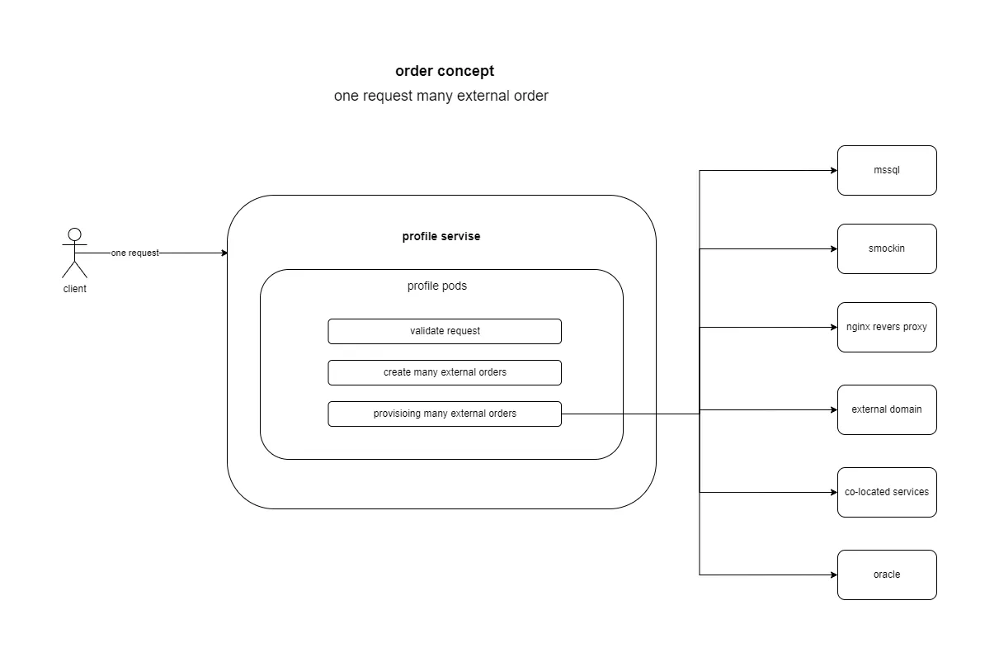
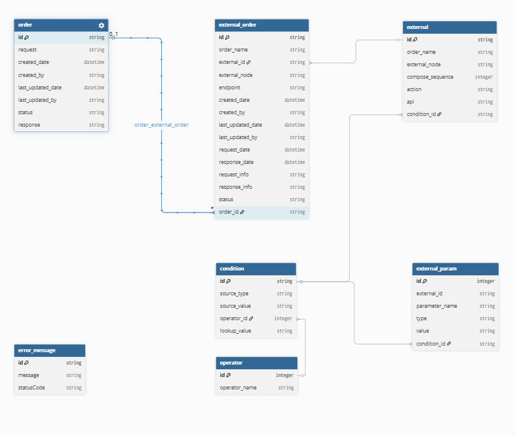
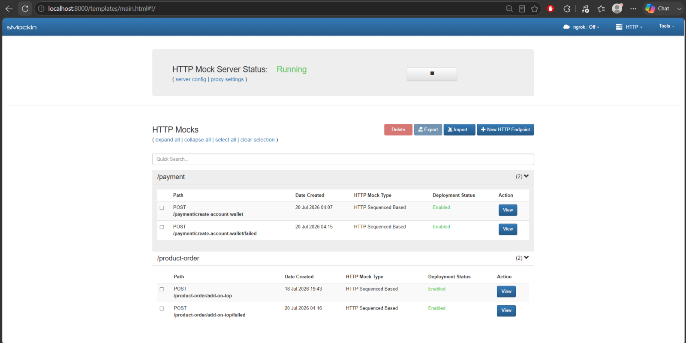
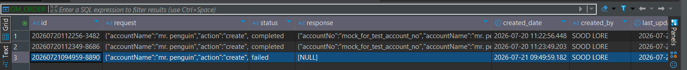
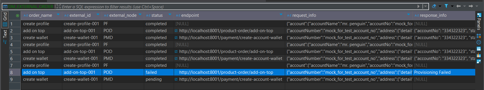
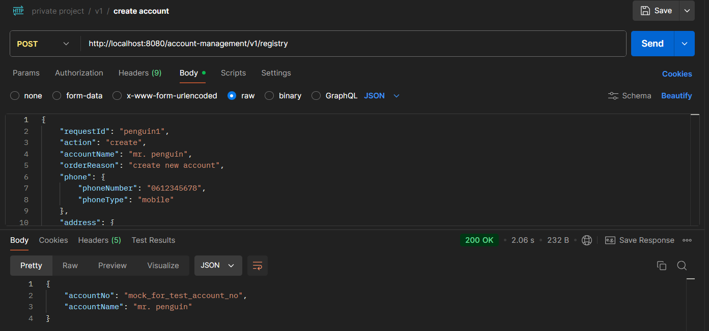
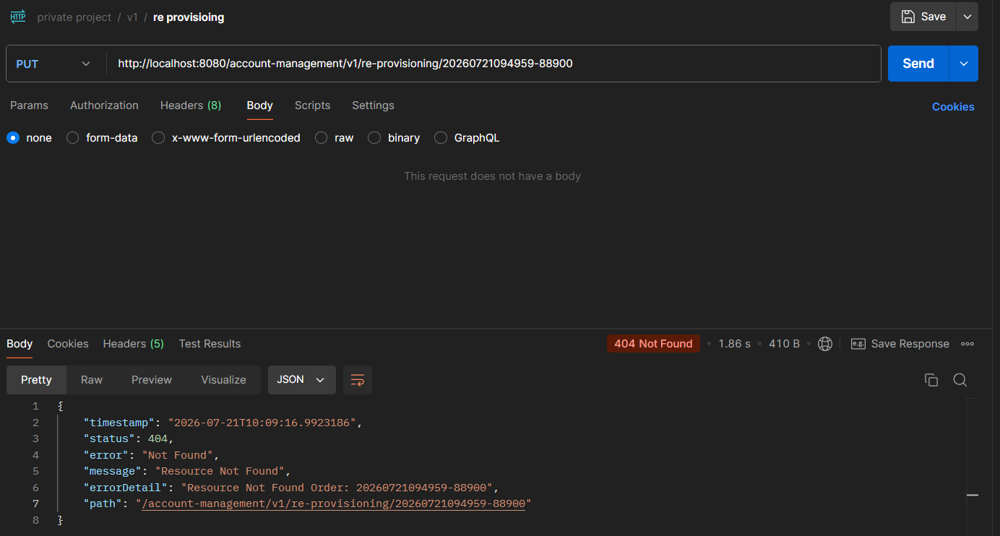

# MICROSERVICE APPLCIATION
## Example of Microservice Application

A Java Spring Boot microservice for account management, providing REST APIs and database integration with Oracle and Microsoft SQL Server. Includes unit testing and API mocking using Smockin.

### Service Concept


### Oder Generate and Management


### Smockin API Testing


### Order Monitoring




### Response Example




`````
 For Cert Management
 Please Add JVM Like
 
-Djavax.net.ssl.trustStore=D:\cert\secur\truststore.jks
-Djavax.net.ssl.trustStorePassword=1234


`````